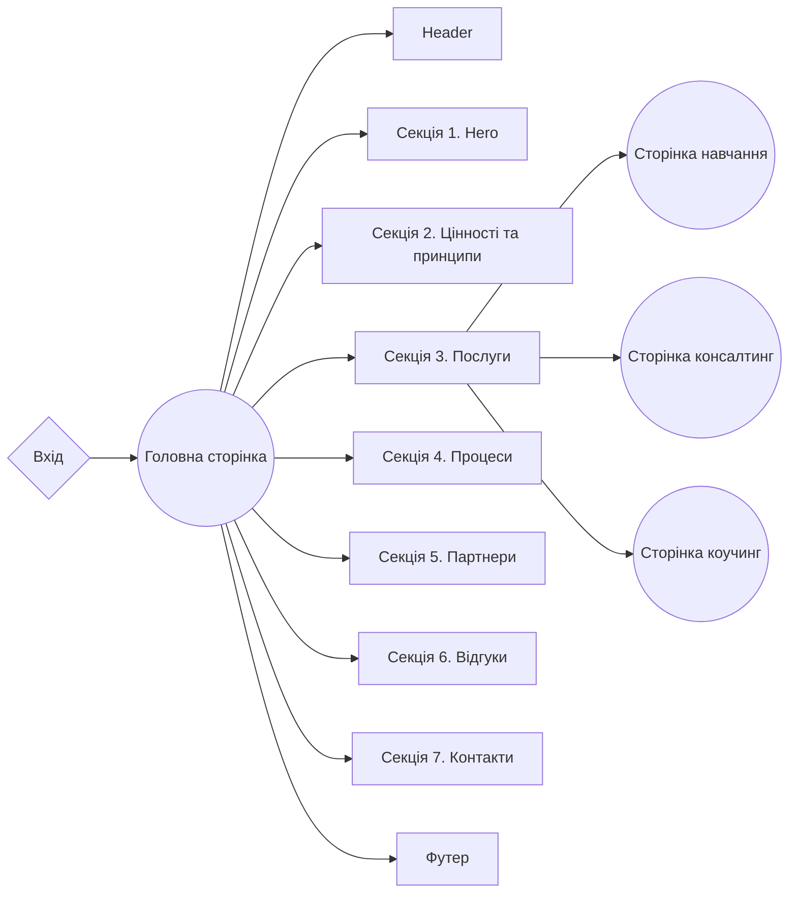

# Проєкт IM CONSULTING 💼

## 📝 Опис проєкту

Сайт-візитка для створення особистого бренду та залучення нових клієнтів та
партнерів.

- **Назва проєкту**: IM CONSULTING
- **Замовник проєкту**: Ілля Мушковський, бізнес тренер, топ консультант,
  антикризовий менеджер, коуч. 🚀

## 🎯 Мета проєкту

- Створення позитивного іміджу особистого бренду.
- Інформування клієнтів.
- Залучення клієнтів / партнерів.
- Отримання зворотнього зв'язку від клієнтів. 📞

## 👥 Цільова аудиторія

- **Вікова категорія**: Від 20 до 65.
- **Рівень доходів**: Середній, високий. 💰

## 🌐 Обсяг продукту

Багатосторінковий сайт-візитка для створення позитивного іміджу особистого
бренду, інформування клієнтів, залучення клієнтів / партнерів та отримання
зворотнього зв'язку від клієнтів. 🌟

## 🛠️ Технічний стек

**Front-end:**

- Next.js ⏭️
- CSS framework: Tailwind 🎨
- Code quality and style: 🧹 `eslint`
- React library: ⚛️ `react`
- Form handling with React: 📝 `react-hook-form`
- Scrolling functionality: 📜 `react-scroll`
- Carousel component: 🎠 `swiper`
- Form validation schema: ✅ `yup`
- Email sending: 📧 nodemailer
- Telegram API 📨

**Back-end:**

- Json 📄

## 🌐 Доступність

- Інтуїтивно зрозумілий дизайн.
- Зручний для мобільних пристроїв.
- Веб-ресурс доступний для будь-якого девайсу, що має підключення до Інтернету
  📱🌐

## 🗣️ Мови, що підтримуються

- Українська 🇺🇦

## 📊 Структура сайту

## 🚀 Розгортання (Deploying)

Для розгортання цього проєкту вам потрібно виконати наступні кроки:

1. Клонуйте репозиторій: Використовуйте команду `git clone` для клонування цього
   репозиторію на ваш комп'ютер.

2. Встановіть залежності: Відкрийте термінал у кореневій папці проєкту та
   виконайте команду `npm install` або `yarn install`, щоб встановити всі
   необхідні залежності.

3. Налаштування змінних середовища: Створіть файл `.env` у кореневій папці та
   додайте необхідні змінні середовища, які вам потрібні для проєкту.

4. Запустіть додаток: Виконайте команду `npm run dev` або `yarn dev`, щоб
   запустити проєкт на локальному сервері.

5. Розгортання: Щоб розгорнути цей проєкт на продакшн-сервері, скористайтеся
   платформами для хостингу, такими як Vercel, Netlify, або інші. 🌐

## 📞 Контакти

Компанія SoftRyzen готова відповісти на ваші запитання і надати додаткову
інформацію:

**Веб-сайт:** [softryzen.com](https://softryzen.com/)

📱 **Телефон:** <a href="tel:+380979769625">+380979769625</a>

📧 **Email:** [services@softryzen.com](mailto:services@softryzen.com)

🎥 **YouTube канал:**
[https://www.youtube.com](https://www.youtube.com/watch?v=_X7NLwgdfgI)

## Дякуємо за вашу увагу! 🙌
